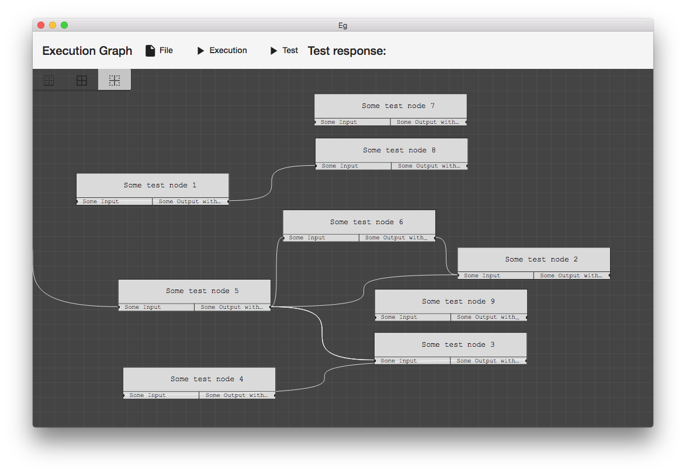

**This library is in alpha and still under development. First usable version will be `v1.1`. Note: This library is under heavy development on the `devGUI` branch! Forking should mainly be considered for looking around, or contributing of course.**


# ExecutionGraph [](https://travis-ci.org/gabyx/ExecutionGraph) 
**Fast Execution Graph consisting of Execution Nodes**

Be able to design and run such input/output graphs, such as the ones used for the work [here](http://gabyx.github.io/GRSFramework/#videos) (using this [graph](https://cdn.rawgit.com/gabyx/GRSFramework/b1414aa0/simulations/examples/jobs/simulationStudies/avalanche1M-Tree-SimStudy/analyzeStartJob/analyzerLogic/FindStart.svg)). A GUI is provided in from of a single-page Angular application with a backend HTTP server which allows interactive design/manipulation and execution of graphs: 



* [Installing and Dependencies](#installing-and-dependencies)
    * [OS X](#os-x)
* [Buidling](#buidling)
* [General Development Setup](#general-development-setup)
    * [Codeformatting](#codeformatting)
    * [On OS X](#on-os-x)
* [GUI Development Setup](#gui-development-setup)
* [Introduction](#introduction)
* [Example 1:](#example-1)
* [Contributors](#contributors)


## Installing and Dependencies
To build the library, the tests and the example you need the build tool [cmake](
http://www.cmake.org).
This library has these dependencies:

- [Eigen](http://eigen.tuxfamily.org) at least version 3, 
- [meta](https://github.com/ericniebler/meta)
- [googletest](https://github.com/google/googletest) (for tests)
- [benchmark](https://github.com/google/benchmark) {benchmarks}
- [crossguid](https://github.com/graeme-hill/crossguid) (guid implementation)
- [args](https://github.com/Taywee/args) (argument parser)
- [memory](https://github.com/foonathan/memory.git) (memory allocators)
- [CEF](https://github.com/chromiumembedded/cef-project) (chrome embedded framwork, for GUI only)
- [rttr](https://github.com/rttrorg/rttr) (runtime type information, for GUI only)
- [spdlog](https://github.com/gabime/spdlog) (logs, for GUI only)

The library `Eigen`, `meta`, `rttr`, `memory` can be installed in some system specific location. However, all dependencies are searched, downloaded and build if not found, during the first super build run.

### OS X
Install `clang` with [homebrew](https://brew.sh) by **updateing your xcode installation**, 
installing a [code-sign certificate](https://llvm.org/svn/llvm-project/lldb/trunk/docs/code-signing.txt)
for lldb and then running:
```bash
    brew install --HEAD llvm --with-toolchain --with-lldb
    brew install eigen
```
We install the latest llvm build, since clang5.0.1 has problems showing `std::string` correctly while using `-fsanitize=address`.
With Clang 7.0 no problems have been detected.

Set the `CXX` and `CC` variables in your `~/.bash_profile` or similar to 
```bash
export OLD_PATH="$PATH"
function enableCompiler(){
  comp="$1"
  if [[ ${comp} == "clang" ]] ; then
    echo "enabling clang7.0"
    export PATH="/usr/local/opt/llvm/bin:$OLD_PATH"
    export CC="/usr/local/opt/llvm/bin/clang"
    export CXX="${CC}++"
    export LDFLAGS="-L/usr/local/opt/llvm/lib -Wl,-rpath,/usr/local/opt/llvm/lib"
    export CPPFLAGS="-I/usr/local/opt/llvm/include -I/usr/local/opt/llvm/include/c++/v1/"
    export CXXFLAGS="$CPPFLAGS"
  elif [[ ${comp} == "clang6" ]] ; then
    echo "enabling clang6"
     export PATH="/usr/local/opt/myllvm6.0rc1/bin:$OLD_PATH"
    export CC="/usr/local/opt/myllvm6.0rc1/bin/clang"
    export CXX="${CC}++"
    export LDFLAGS="-L/usr/local/opt/myllvm6.0rc1/lib -Wl,-rpath,/usr/local/opt/llvm/lib"
    export CPPFLAGS="-I/usr/local/opt/myllvm6.0rc1/include -I/usr/local/opt/myllvm6.0rc1/include/c++/v1/"
    export CXXFLAGS="$CPPFLAGS"
  elif [[ ${comp} == "gcc" ]] ; then
    echo "enabling gcc7.2"
    export PATH="/usr/local/opt/$comp/bin:$OLD_PATH"
    export CC="/usr/local/opt/$comp/bin/gcc-7"
    export CXX="/usr/local/opt/$comp/bin/g++-7"
    export LDFLAGS="-L/usr/local/opt/$comp/lib/gcc/7 -Wl,-rpath,/usr/local/opt/$comp/lib/gcc/7"
    export CPPFLAGS="-I/usr/local/opt/$comp/include -I/usr/local/opt/$comp/include/c++/7.2.0"
    export CXXFLAGS="$CPPFLAGS"
  elif [[ ${comp} == "gcc@4.9" ]] ; then
    echo "enabling gcc@4.9"
    export PATH="/usr/local/opt/$comp/bin:$OLD_PATH"
    export CC="/usr/local/opt/$comp/bin/gcc-4.9"
    export CXX="/usr/local/opt/$comp/bin/g++-4.9"
    export LDFLAGS="-L/usr/local/opt/$comp/lib/gcc/4.9 -Wl,-rpath,/usr/local/opt/$comp/lib/gcc/4.9"
    export CPPFLAGS="-I/usr/local/opt/$comp/include -I/usr/local/opt/$comp/include/c++/4.9.4/"
    export CXXFLAGS="$CPPFLAGS"
  else
    echo "enabling no compiler"
    export PATH="$OLD_PATH"
    export CC=
    export CXX=
    export LDFLAGS=
    export CPPFLAGS=
    export CXXFLAGS=
  fi
}
export -f enableCompiler

enableCompiler "clang"
```
Use the `enableCompiler` function to quickly switch to another compiler, e.g. `gcc`.
Restart VS Code if you reconfigured!
Now you should be ready to configure with cmake:

## Buidling
```bash
    cd <pathToRepo>
    mkdir build
    cd build
    # configuring the superbuild
    cmake .. -DUSE_SUPERBUILD=ON
    # building the superbuild configuration 
    make -j all
    # configuring the actual build
    cmake ..
    # building the library/gui
    make -j <targetName>
```
We use a super build setup. The first cmake configure and build by using `-DUSE_SUPERBUILD=ON` (automatically set at first run) will download every dependency and build the ones which need installing (currently [rttr](http://www.rttr.org/), [memory](https://github.com/foonathan/memory.git), [crossguid](https://github.com/graeme-hill/crossguid)). See the path `build/external`. The path `build/external/install` is used for all built dependencies during the super build. If you configure cmake in VS Code with the extension, the external build path is set to `buildFolder` for convenience to be able to quickly delete certain dependencies without deleting the normal build folder `build`).   
After the super build, the cmake cache file `CMakeCache.txt` is setup with all necessary variables, that **later** cmake *configure* invocations will find all dependencies 
and configure the actual project. This works also with VS Code and the cmake extension.

## General Development Setup
If you start developing, install the pre-commit/post-commit hooks with:
```bash
    npm install -g json-fmt xmllint
    brew install plantuml
    cd .git && mv hooks hooks.old && ln -s ../tools/git-hooks hooks
```

### Codeformatting
``` 
    tools/formatAll.sh
```

### On OS X
Install XCode and the CommandLine Tools from [Apple](https://developer.apple.com/download/more/)  
Install [Visual Studio Code](https://code.visualstudio.com/)  

**Note:** Dont use the [multi-root workspaces](https://code.visualstudio.com/docs/editor/multi-root-workspaces) feature in VS Code since the C++ Extension does not yet support this and code completion won't work properly.

## GUI Development Setup
The UI is made up of an [Angular](https://angular.io) application that uses the [Angular CLI](https://cli.angular.io) to create the web assets that are ultimately displayed in an [electron app](https://electronjs.org/) browser.
The client backend consists of a http server which provides the executiong graph.
Please visit the Angular CLI website for its prerequisites (node.js and npm respectively, also a globally installed Angular CLI aka `ng`).
Once you installed the prerequisites build the client application by navigating to the client directory and starting the build process.

```bash
cd gui/client
npm install
npm run serve
```

For more information about the development of the client application please refer to the dedicated [client documentation](gui/client/README.md)

## Introduction

The execution graph implemented in `ExecutionTree` is a directed acyclic graph consisting of several connected nodes derived from `LogicNode` which define a simple input/output control flow.
Each node in the execution graph contains several input/output sockets (`LogicSocket`) with a certain type out of the predefined types defined in `LogicSocketTypes`. 

An execution graph works in the way that each node contains a specific `compute` routine which provides values for the output sockets by using the values from the input sockets. 
Each output of a node can be linked to an input of the same type of another node. This means an output socket of the arithmetic type `double` cannot be linked to an input socket of integral type `int` for example. 
Each node can be assigned to one or more execution groups which are collections of nodes and form directed acyclic subgraphs. 

For each execution group, an execution order is computed such that the data flow defined by the input/output links in the group is respected.

An execution order of an execution group is called a *topological ordering* in computer science, and such an ordering always exists for a directed acyclic graph, despite being non-unique. A topological ordering of an execution group is an ordering of all nodes such that for all connections from a node `A` to `B`, `A` precedes `B` in the ordering. Each execution graph network consists of several input nodes whose output sockets are initialized before executing the network. 
The implementation in `LogicSocket` allows two types of directed links between an input and output socket, namely a *get* and a *write* connection. 

A *write* link is a link from an output socket `i` of a node `A` to an input socket `j` of some node `B`, denoted as `{A,i} -> {j,B}`.
A *write* link basically duplicates a write request to the output socket `i` of `A` also to an additional write request to the input socket `j` of `B`.

A *get* link is the exact opposite and is a link from an input socket `j` of a node `B` to an output socket `i` of a node `A`, denoted as 
`{A,i} <- {j,B}`. 
A *get* link basically forwards any read access on the input socket `j` of `B` to a read access on the input socket `i` of `A`.

Most of the time only *get* links are necessary but as soon as the execution graph becomes more complex and certain switching behavior should be reproduced, the additional *write* links are a convenient tool to realize this. 

Cyclic paths between nodes are detected and result in an error when building the execution network.
The write and read access to input and output sockets is implemented using a fast static type dispatch system in `LogicSocket`.

Static type dispatching avoids the use of virtual calls when using polymorphic objects in object-oriented programming languages.

## Example 1: 
Source: `examples/libraryUsage`   
Let us build the simple directed graph below:
```
Node 1a,0
+-------+
|i0     |
|     o0+------+   Node 3a,4
|i1     |      |   +-------+
+-------+      +--->i0     |
Node 1b,1          |     o0+-----+
+-------+      +--->i1     |     |
|i0     |      |   +-------+     |
|     o0+------+                 |
|i1     |                        |   Node 4a,6
+-------+                        |   +-------+
                                 +--->i0     |
                                     |     o0|
Node 2a,2                        +--->i1     |
+-------+                        |   +-------+
|i0     |                        |
|     o0+------+   Node 3b,5     |
|i1     |      |   +-------+     |
+-------+      +--->i0     |     |
Node 2b,3          |     o0+-----+
+-------+      +--->i1     |
|i0     |      |   +-------+
|     o0+------+
|i1     |
+-------+
```
This execution tree consists of 4 input nodes, e.g. Node `1a`, `1b`, `2a`, `2b`, and 1 output node `4a`.
Each node has 2 input sockets, e.g. denoted as `i0` and `i1`, and one output socket `o0`.
The type of the input and output sockets in this example is simply `int`.
Each node computes the sum of both input sockets `i0` and `i1` and stores it in the output socket `i1` (of course this is kind of stupid, it is only an example =).

First, we define our node type called `IntegerNode<...>`:
```c++
template<typename TConfig>
class IntegerNode : public typename TConfig::NodeBaseType
{
public:
    using Config = TConfig;
    using NodeBaseType = typename Config::NodeBaseType;
    enum Ins
    {
        Value1,
        Value2
    };
    enum Outs
    {
        Result1,
    };
```
We start of by deriving our `IntegerNode` from `TConfig::NodeBaseType`. The template parameter `TConfig` lets us configure our execution graph (especially the socket type list).
The type `TConfig::NodeBaseType` is the basis class for all nodes (resulting in `LogicNode<Config>`).
The two enumerations `Ins` and `Outs` let us define some handy abbreviations for our input sockets (`Value1` and `Value2`) and our output socket (`Result1`). The sequential ordering of the enumerations in `Ins` and `Outs` does not matter at all! So far so good. Now we use some macro for letting us specify the input/output ordering:
```c++
private:
    EXECGRAPH_DEFINE_SOCKET_TRAITS(Ins, Outs);
    // Define the input socket decleration list:
    using InSockets  = InSocketDeclList<InSocketDecl<Value1, int>,
                                        InSocketDecl<Value2, int>>;
    // Define the input socket decleration list:
    using OutSockets = OutSocketDeclList<OutSocketDecl<Result1, int>>;
```
What we are specifying here is the following:
The type `InSockets` is a *socket declaration list* which says that the input socket with enumeration value `Value1` is of type `int` and is the first input `i0`. The second entry defines the second input socket with enumeration value `Value2` which is of type `int` too.
The same is done for our output by defining `OutSockets`.

Now we define two other handy macros:
```c++
    EXECGRAPH_DEFINE_LOGIC_NODE_GET_TYPENAME();
    EXECGRAPH_DEFINE_LOGIC_NODE_VALUE_GETTERS(Ins, InSockets, Outs, OutSockets);
```
The first one is not so important. It only defines some `virtual std::string getTypeName()` function which demangles the type of this node at runtime (for debugging purposes).
The second one defines some handy value-getters and setters for easy access (by means of the enumerations `Ins` and `Outs`) to the sockets values (more later).

Let us define the constructor of our `IntegerNode<...>`:
```c++
template<typename... Args>
    IntegerNode(Args&&... args)
        : NodeBaseType(std::forward<Args>(args)...)
    {
        this->template addSockets<InSockets>(std::make_tuple(2,2));
        this->template addSockets<OutSockets>(std::make_tuple(0));
    }
```
In the constructor, we create (add) the input and output sockets to the node. The parameter `std::tuple<...>` contains the default (constructor) values for the values stored in the sockets. So in the above snippet, we set the input sockets both to the value `2` and the output socket to the value `0`.
Next we define the actual computation which is performed when this node is executed:
```c++
    void compute() override {
        getOutVal<Result1>() = getInVal<Value1>() + getInVal<Value2>();
    }
}; // end of class declaration
```
Here we simply add both input values ( `getInVal<...>()` return a reference) and store the result in the output socket.

Now, let us build the main ingredient of this example: the execution tree. 
First we allocate the 7 nodes by
```c++
using namespace executionGraph; 
int main(){
    using Config = GeneralConfig<>; // we use the default configuration
    
    auto node1a = std::make_unique<IntegerNode<Config>>(0);
    auto node1b = std::make_unique<IntegerNode<Config>>(1);
    auto node2a = std::make_unique<IntegerNode<Config>>(2);
    auto node2b = std::make_unique<IntegerNode<Config>>(3);
    auto node3a = std::make_unique<IntegerNode<Config>>(4);
    auto node3b = std::make_unique<IntegerNode<Config>>(5);
    auto node4a = std::make_unique<IntegerNode<Config>>(6);
    auto resultNode = node4a.get();
```
Each node is given a unique id `[0,...,6]`, which enables us to identify the nodes easier.
Next we create the *get* links which connect the in- and outputs. 
```c++
    int i0 = 0; int i1 = 1; int o0 = 0;
    node4a->setGetLink(*node3a,o0,i0);
    node4a->setGetLink(*node3b,o0,i1);

    node3a->setGetLink(*node1a,o0,i0);
    node3a->setGetLink(*node1b,o0,i1);
    
    node3b->setGetLink(*node2a,o0,i0);
    node3b->setGetLink(*node2b,o0,i1);
```
The syntax `node4a->setGetLink(*node3a,o0,i0);` denotes that the output node `node4a` gets its first input value `i0 = 0` from the single output `o0 = 0` of node `node3a`. The above snippet builds the execution tree given at the begining.
Finally we create the ExecutionTree `ExecutionTree`, add all nodes to it, set the proper node classfication (if its an input or output node, setup the graph (which computes the execution order) and execute the default execution group `0` as
```c++
    // Make the execution tree and add all nodes
    ExecutionTree<Config> execTree;
    execTree.addNode(std::move(node1a)); // The execution tree owns the nodes!
    execTree.addNode(std::move(node1b));
    execTree.addNode(std::move(node2a));
    execTree.addNode(std::move(node2b));
    execTree.addNode(std::move(node3a));
    execTree.addNode(std::move(node3b));
    execTree.addNode(std::move(node4a));

    // Set all node classifications
    execTree.setNodeClass(0, ExecutionTree<Config>::NodeClassification::InputNode);
    execTree.setNodeClass(1, ExecutionTree<Config>::NodeClassification::InputNode);
    execTree.setNodeClass(2, ExecutionTree<Config>::NodeClassification::InputNode);
    execTree.setNodeClass(3, ExecutionTree<Config>::NodeClassification::InputNode);
    execTree.setNodeClass(6, ExecutionTree<Config>::NodeClassification::OutputNode);
    
    // Setup the execution tree
    execTree.setup();
    EXECGRAPH_LOG_INFO(execTree.getExecutionOrderInfo());
    execTree.execute(0); // execute the default execution group (=0)
    EXECGRAPH_LOG_INFO("Result : "<< resultNode->getOutVal<IntegerNode<Config>::Result1>());
```
This outputs the following execution order:
```c++
Execution order for group id: 0
    NodeId  |  Priority  |  NodeType            
    ------  |  --------  |  --------            
         0  |         2  |  IntegerNode<executionGraph::GeneralConfig<...> >*
         1  |         2  |  IntegerNode<executionGraph::GeneralConfig<...> >*
         2  |         2  |  IntegerNode<executionGraph::GeneralConfig<...> >*
         3  |         2  |  IntegerNode<executionGraph::GeneralConfig<...> >*
         5  |         1  |  IntegerNode<executionGraph::GeneralConfig<...> >*
         4  |         1  |  IntegerNode<executionGraph::GeneralConfig<...> >*
         6  |         0  |  IntegerNode<executionGraph::GeneralConfig<...> >*
    ------  |  --------  |  --------  
```

## Contributors
- Gabriel Nützi (graph)
- Simon Spörri (gui, graph)
