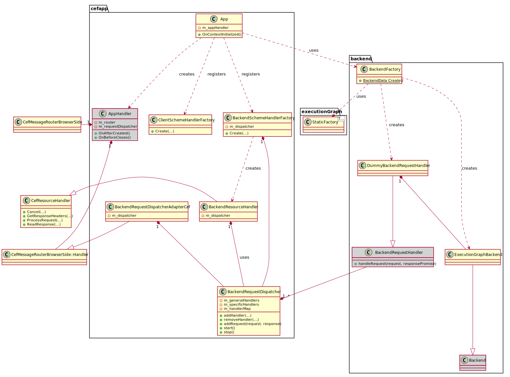

Specifications for Client and Backend Communication
===
In this document *client* is referred to the Angular implementation in `./client` which provides the GUI (HTML/CSS/TypeScript) implementation. The *backend*  is referred to the C++ implementation in `./backend`.

The communication between *client* and *backend* is done over the `./client/.../CefMessageRouterService.ts` which executes the pre-registered `window.cef.cefQuery` on the *client* side and the receiving router `m_router` in `./cefapp/AppHandler.hpp`. Several message handlers are installed in the router `m_router` for the backend, in this case the `backend/ExecututionGraphBackend.cpp`, which provides all functionality for reading, storing, manipulating and executing a graph consisting of `LogicNodes`.



The application registers a file scheme handler factory `FileSchemeHandlerFactor` during `App::OnContextInitialized`. In this function, it also creates an application handler instance `AppHandler` which is forwarded to `CefBrowserHost::CreateBrowser`. 

During `AppHandler::OnAfterCreated()`, a message dispatcher `m_messageDispatcher` of type `MessageDispatcher` is registerd at a newly instantiated `m_router` of type `CefMessageRouterBrowserSide`. Then, `AppHandler::initializeBackends()` is called which uses the `BackendFactory` to create the backends. At the moment, a backend instance of type `ExecutionGraphBackend` with its associated message handlers, currently an instance of `DummyBackendMsgHandler`, is created.
The message handlers may share the instance of the backend internally.
At last, the message handlers of all backends are then added to the `m_messageDispatcher`. 

During communication, the dispatcher will forward all messages to its shared `BackendMessageHandlers` instances.

## Overview of MessageHandler Types
We need one message handlers for each of the following grouped functionalities:

-   Graph Creation Queries:
    * Add graph with id `graphId`
    * Delete graph with id `graphId`

-   Graph Info Queries :
    * Get info of all available socket types.
    * Get info of all addable node types.
    * Info query on node(s).
    * Info query on connection(s).

-   Serialization Functionalities:
    * Load a graph from a `.json` file into the backend and send a validated (possibly modified) graph summary info + the client `.json` back to the client such that it can visualize it.

    * Serialize a graph to a `.json` file. Corresponging of a serialization of the client data (gui visualization data) and backend data.

-   Graph Manipulation Queries:
    * Add/Remove node(s)
    * Add/Remove connection(s)

    * Set/Get node settings (`group id`, possible other custom node specific settings)

- Graph Execution Functionalities:
    * Run graph
    * Stop graph

## How To Serialize
I strongly think we should try to use FlatBuffers
as it is C++ and has JS wrappers to =), Awesomeness has arrived :-)!
https://google.github.io/flatbuffers/flatbuffers_guide_use_javascript.html 
or Protocol Buffers (which would be more supported I think...)
https://github.com/dcodeIO/ProtoBuf.js/


## Message Specification: Graph Manipulation Queries
Adding a node to the execution graph means:
Client -> Backend:
```json
{
    "messageType" : "addNode",
    "graphId" : ${guid},
    "nodeType" : "MyStupidSquareRoot",
    "constructorArgs" : ${args},
    ...
}
```

Backend -> Client:
```json
{
    "messageType" : "addNode-response",
    "nodeId" : 3
    ...
}
```