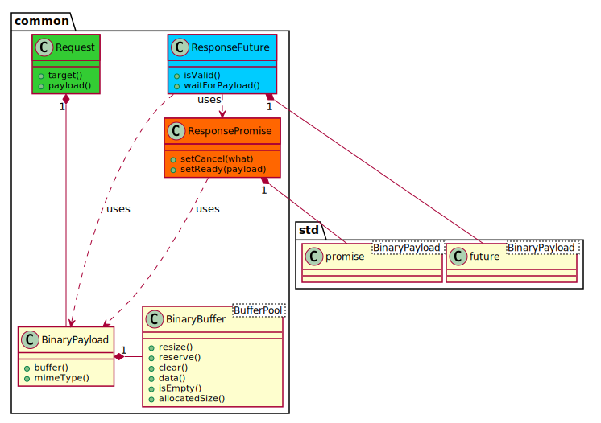

Specifications for Client and Backend Communication
===
In this document *client* is referred to the Angular implementation in `./client` which provides the GUI (HTML/CSS/TypeScript) implementation. The *backend*  is referred to the C++ implementation in `./backend` which si provided by a HTTP server in `./server`.

The communication between *client* (typescript) and *backend* (server) is done over the HTTP Request/Responses.

At the moment, the server provides a backend instance of type `ExecutionGraphBackend` with its associated request handlers (sharing the backend) which are registered at the request dispatcher `BackendRequestDispatcher`. 
The HTTP server receives any request in an session instance `HttpSession` which then forwards the request to the backend request dispatcher.

## Message Send/Receive Workflow
Communication workflow for HTTP Request/Responses on the scheme `http://<server-ip>/eg-backend` between the client and the backend server.



## Serilaization of Messages
The messages get serialized and deserialized with [FlatBuffers](https://google.github.io/flatbuffers/).
The schemas can be found in `gui/executionGraphGui/messages/schemas`. The serialization of specific components of an execution graph are located in `include/executionGraph/serialization`.

## Message Types
One message handlers is associated for each of the following grouped functionalities:
The base template url of the backend is `http://<server-ip>/eg-backend/${target}` and all HTTP requests are sent to this url.

-   **Graph Mangement Requests:**
    RequestHandler: `GraphManagementRequestHandler.hpp`
    Client Service: `GraphManagementServiceBinaryHttp.ts`
    * Add graph:
        - `target = "general/addGraph"`
        - request method: `POST`
        - schema: `GraphManagementMessages.fbs`
        - request `AddGraphRequest`
        - response: `AddGraphResponse`

    * Remove graph:
        - `target = "general/removeGraph"`
        - request method: `POST`
        - schema: `GraphManagementMessages.fbs`
        - request `RemoveGraphRequest`
        - response: `RemoveGraphRequest`

-   **Graph Serialization Requests:**
     * Load a graph: 
    From a `.eg` file into the backend and send a validated (possibly modified) graph serialization + opaque visualization data back to the client such that it can visualize it:
        - `target = "general/loadGraph"`
        - request method: `POST`
        - schema: `GraphSerializationMessages.fbs`
        - request `LoadGraphRequest`
        - response: `LoadGraphResponse` 

    * Save a graph:
     To a `.eg` file. Merge the client data (gui visualization data) and graph data from the backend:
        - `target = "general/saveGraph"`
        - request method: `POST`
        - schema: `GraphSerializationMessages.fbs`
        - request `SaveGraphRequest`
        - response: `SaveGraphResponse`

-   **General Info Requests:**
    RequestHandler: `GeneralInfoRequestHandler.hpp`
    Client Service: `GeneralInfoServiceBinaryHttp.ts`
    * Get info of all available socket types and node types (of a graph):
        - url: `target = "general/getAllGraphTypeDescriptions"`
        - request method: `GET`
        - schema: `GeneralInfoMessages.fbs`
        - response: `GetAllGraphTypeDescriptionsResponse`

-   **Graph Info Requests:**
    * Info query on node(s):
    * Info query on connection(s):

-   **Graph Manipulation Requests:**
    Request Handler: `GraphManipulationRequestHandler.hpp`
    Client Service: `GraphManipulationServiceBinaryHttp.ts`
    * Add node:
        - url: `target = "graph/addNode"`
        - request method: `POST`
        - schema: `GraphManipulationMessages.fbs`
        - request: `AddNodeRequest`
        - response: `AddNodeResponse`
    * Add node:
        - url: `target = "graph/removeNode"`
        - request method: `POST`
        - schema: `GraphManipulationMessages.fbs`
        - request: `RemoveNodeRequest`
        - response: `None`
    * Add connection:
        - url: `target = "graph/addConnection"`
        - request method: `POST`
        - schema: `GraphManipulationMessages.fbs`
        - request: `AddConnectionRequest`
        - response: `AddConnectionResponse`
    * Add node:
        - url: `target = "graph/removeConnection"`
        - request method: `POST`
        - schema: `GraphManipulationMessages.fbs`
        - request: `RemoveConnectionRequest`
        - response: `None`

    * Set/Get node settings (`group id`, possible other custom node specific settings):

- **Graph Execution Functionalities:**
    * Run graph:
    * Stop graph:

```